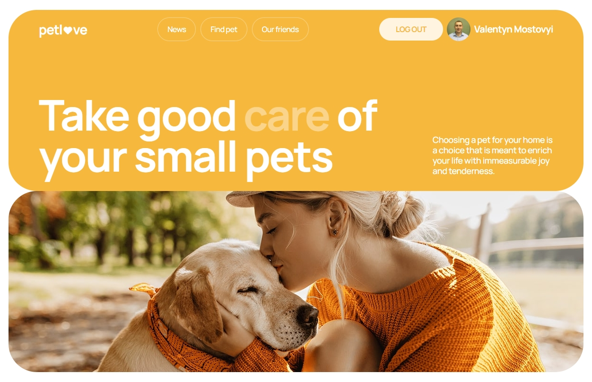

# petlove 🐾



## 📋 About the Project

**Petlove** is a web application for pet lovers that helps find, care for, and share information about pets. The platform connects pet owners, provides useful news, and allows finding partners for pet care.

### Main Features:

- 📰 **News** - up-to-date information about the pet world
- 🔍 **Notice Search** - finding pets by various criteria
- ❤️ **Favorites** - saving interesting notices
- 👥 **Partners** - information about veterinary clinics and pet stores
- 👤 **User Profile** - managing personal data and pets
- ➕ **Add Pets** - registering your own pets

## 🛠️ Technologies

### Frontend:

- **React 18** - main framework
- **React Router** - routing
- **Redux Toolkit** - state management
- **React Hook Form + Yup** - form handling and validation
- **React Select** - dropdown lists with search
- **CSS Modules / Styled Components** - styling
- **Responsive Design** - adaptive layout

### Additional Tools:

- **Axios** - HTTP requests
- **React Toastify** - notifications
- **ESLint + Prettier** - code quality control

## 📱 Responsiveness

The application is fully responsive and supports the following screen sizes:

- 📱 **Mobile**: from 320px (fluid) / from 375px (adaptive)
- 📱 **Tablet**: from 768px
- 💻 **Desktop**: from 1280px

## 🎨 Design

**Figma Layout**: [PetLove Design](https://www.figma.com/file/puMNfZVg4YI8UZoJ1QiLLi/Petl%F0%9F%92%9Bve?type=design&node-id=55838-750&mode=design&t=Xg1IwIcKebTl5xGs-0)

## 🔗 API

**Backend Documentation**: [PetLove API](https://petlove.b.goit.study/api-docs/)

## 🚀 Project Structure

```
src/
├── components/         # Reusable components
├── pages/              # Application pages
│   ├── HomePage/       # Home page
│   ├── NewsPage/       # News page
│   ├── NoticesPage/    # Notices page
│   ├── FriendsPage/    # Partners page
│   ├── ProfilePage/    # User profile
│   ├── LoginPage/      # Authorization
│   ├── RegisterPage/   # Registration
│   ├── NotFoundPage    # Not found page
│   └── AddPetPage/     # Add pet page
├── store/              # Redux store and slices
├── api/                # API services
├── hooks/              # Custom hooks
├── utils/              # Utility functions
├── assets/             # Static resources
└── styles/             # Global styles, reset styles, mixins ...
```

## 🔐 User Functionality

### Unauthorized Users:

- View news, notices, and partners
- Search and filter notices
- Registration and authorization

### Authorized Users:

- All functionality of unauthorized users
- Add notices to favorites
- View detailed notice information
- Profile management
- Add own pets
- View browsing history

## 🎯 Implementation Features

- **Semantic markup** according to HTML5 standards
- **Image optimization** for retina displays
- **SVG sprites** for icons
- **Server-side pagination** with navigation
- **Form validation** with detailed error messages
- **Notification system** for user alerts
- **Lazy loading** for performance optimization
- **Error boundaries** for error handling

## 🏁 Getting Started

1. Clone the repository:

```bash
git clone [repository-url]
```

2. Install dependencies:

```bash
npm install
```

3. Start the project:

```bash
npm start
```

4. Open [http://localhost:3000](http://localhost:3000) in your browser

## 📦 Build for Production

```bash
npm run build
```

## 👨‍💻 Author

**Valentyn Mostovyi** - Frontend Developer

---

**PetLove** - created with ❤️ for pet lovers
